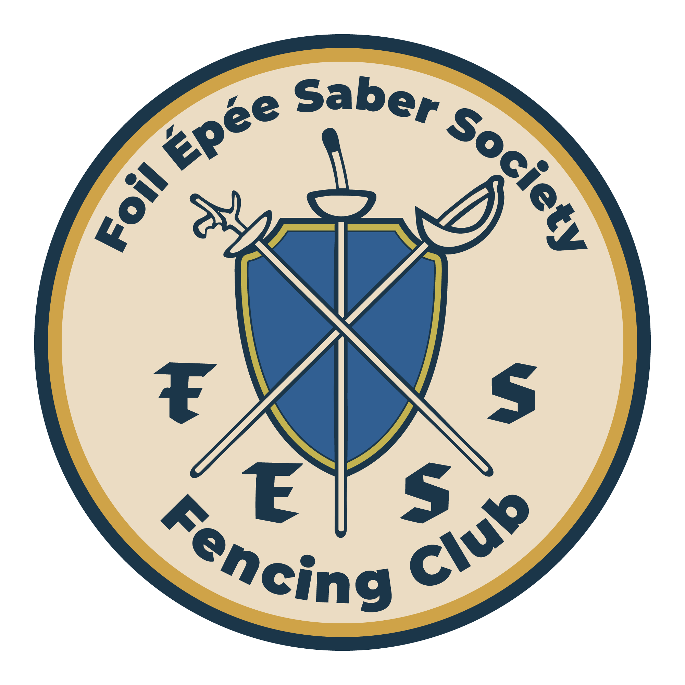

  

# FESS Digital Scoring Interface

A Python + PyQt6 desktop application for a modern fencing scoring system.

This project is being developed in connection with the **Foil Épée Saber Society (FESS) Fencing Club** at **Tennessee Tech University**. 

This repository is being developed by **Alden Simmons**, President of the FESS Fencing Club and a Computer Science student at Tennessee Tech University. 

The project combines club needs with software development, with the goal of building a clean and useful digital scoring interface for fencing. Without paying for overpriced software and hardware.

## FRIMB

This project is also intended to work alongside the **FESS Repeater Intercept Module Bridge (FRIMB)**. Which is a custom hardware interface I designed and built to connect fencing scoring machine repeater outputs to a computer-readable input system. Otherwise, if I plugged my laptop into the SG-11 it would have fried my laptop, not optimal.

The purpose of FRIMB is to help bridge external scoring hardware with a computer so that software control and display logic could be made, thus allowing the digital interface to react to real scoring events.

## MVP Established
The first iteration of this project was a minimal viable product. A visual interface that took simple inputs from a wireless game controller to change the score, start/stop the time. The FRIMB also reliably working to relay a touch to the Arduino that simulated a key stroke to stop the timer.

The hardware side of this project is already built. The **FRIMB** hardware interface is intended to let a connected fencing weapon or scoring signal behave like a keyboard input for testing and software integration. Right now, the software side is using direct keyboard mappings as a temporary stand-in, so a live hardware signal would effectively simulate the same keystroke behavior.

### Current Test Key Mappings

#### General / Directeur-style testing
- **Spacebar**: Start / pause / resume the bout timer
- **Left Arrow**: Increment left score
- **Up Arrow**: Decrement left score
- **Right Arrow**: Increment right score
- **Down Arrow**: Decrement right score
- **R**: Simulate a red-side touch input and halt the timer
- **G**: Simulate a green-side touch input and halt the timer
- **Backspace**: Reset the bout timer and both scores to zero

#### Temporary automatic-scoring testing
- **Spacebar**: Start / pause / resume the bout timer
- **Left Arrow**: Increment left score
- **Up Arrow**: Decrement left score
- **Right Arrow**: Increment right score
- **Down Arrow**: Decrement right score
- **R**: Simulate a red-side touch, award the point, halt, then auto-resume after 5 seconds
- **G**: Simulate a green-side touch, award the point, halt, then auto-resume after 5 seconds
- **Backspace**: Reset the bout timer and both scores to zero

## Current Focus

This project is currently in the early UI and architecture stage.  
Right now the main goals are:

- building the main menu
- creating a clean interface
- separating pages into their own files
- setting up navigation between views
- refining the scoreboard structure

## Planned Sections

- Main Menu
- Combat Modes
- Profiles & Statistics
- Controls
- Tournament
- Scoreboard (MVP certainly will be ammended)

## Stack

- Python
- PyQt6

## Status

Work in progress.  
This repository is currently being used to prototype layout, navigation, and page structure before full functionality is implemented.
